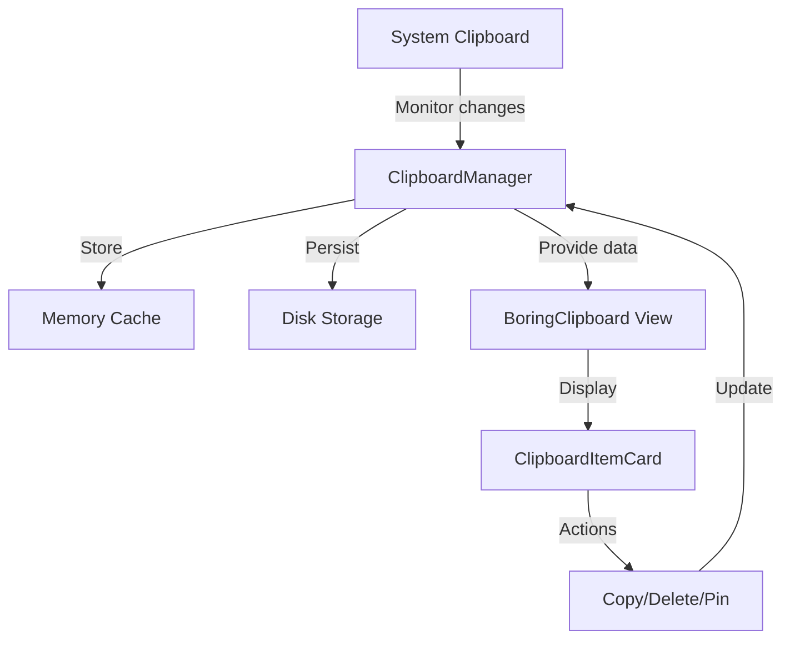

# Clipboard Tab Implementation Plan

## 1. System Architecture



## 2. Data Model

We'll need to create several new models:

### ClipboardItem Model
```swift
struct ClipboardItem: Identifiable, Codable {
    let id: UUID
    let timestamp: Date
    let type: ClipboardItemType
    var isPinned: Bool
    
    // Content will be stored differently based on type
    var textContent: String?
    var imageFilePath: String?
    var fileURL: URL?
    var fileType: String?
    var fileName: String?
    
    // Computed property for preview text (for text items)
    var previewText: String {
        return textContent?.prefix(100) ?? ""
    }
}

enum ClipboardItemType: String, Codable {
    case text
    case image
    case file
}
```

## 3. Clipboard Manager

The ClipboardManager will be responsible for:

1. Monitoring the system clipboard for changes
2. Storing clipboard items in memory and on disk
3. Managing the clipboard history (add, delete, pin items)
4. Providing methods to copy items back to the clipboard

```swift
class ClipboardManager: ObservableObject {
    @Published var clipboardItems: [ClipboardItem] = []
    @Published var pinnedItems: [ClipboardItem] = []
    
    private let fileManager = FileManager.default
    private let storageDirectory: URL
    private var clipboardChangeTimer: Timer?
    private var lastChangeCount: Int = 0
    
    // Memory management
    private let maxItemsInMemory: Int = 50
    private let batchSize: Int = 20
    
    init() {
        // Setup storage directory
        // Monitor clipboard changes
        // Load saved items
    }
    
    // Monitor clipboard changes
    func startMonitoring() {
        // Use timer to check NSPasteboard.general.changeCount
    }
    
    // Handle new clipboard content
    func handleClipboardChange() {
        // Check content type and create appropriate ClipboardItem
        // Store to disk
        // Update in-memory collection
    }
    
    // Memory management
    func loadMoreItems(before date: Date) {
        // Load batch of older items from disk
    }
    
    // Actions
    func copyToClipboard(item: ClipboardItem)
    func deleteItem(item: ClipboardItem)
    func togglePin(item: ClipboardItem)
    
    // Persistence
    func saveItem(_ item: ClipboardItem)
    func loadItems(limit: Int, offset: Int) -> [ClipboardItem]
    func loadPinnedItems() -> [ClipboardItem]
}
```

## 4. UI Components

### BoringClipboard View
```swift
struct BoringClipboard: View {
    @StateObject private var clipboardManager = ClipboardManager()
    @State private var searchText: String = ""
    
    var body: some View {
        VStack {
            // Search bar
            // Pinned items section
            // Regular items section with lazy loading
        }
    }
}
```

### ClipboardItemCard View
```swift
struct ClipboardItemCard: View {
    let item: ClipboardItem
    let onCopy: () -> Void
    let onDelete: () -> Void
    let onPin: () -> Void
    
    var body: some View {
        // Card UI with preview based on content type
        // Action buttons
    }
}
```

## 5. Integration with Existing App

### Update NotchViews Enum
```swift
public enum NotchViews {
    case home
    case shelf
    case reminders
    case clipboard  // New case
}
```

### Update Tabs Array
```swift
let tabs = [
    TabModel(label: "Home", icon: "house.fill", view: .home),
    TabModel(label: "Shelf", icon: "tray.fill", view: .shelf),
    TabModel(label: "Reminders", icon: "checkmark.circle", view: .reminders),
    TabModel(label: "Clipboard", icon: "doc.on.clipboard", view: .clipboard)  // New tab
]
```

### Update ContentView
```swift
switch coordinator.currentView {
case .home:
    NotchHomeView(albumArtNamespace: albumArtNamespace)
case .shelf:
    NotchShelfView()
case .reminders:
    BoringReminders()
case .clipboard:
    BoringClipboard()  // New case
}
```

## 6. Memory Management Strategy

To handle unlimited clipboard history without memory issues:

1. **Lazy Loading**: Only load a limited number of items in memory at once
2. **Pagination**: Load more items when the user scrolls
3. **Disk Storage**: Store all items on disk in a structured format
4. **Compression**: Compress large images before storing
5. **Thumbnail Generation**: For images, store thumbnails for preview and load full images on demand
6. **Cleanup**: Implement optional automatic cleanup of very old items (configurable)

## 7. Settings Integration

Add clipboard-related settings to the app's settings panel:

- Maximum history size (or unlimited)
- Auto-cleanup options
- Default view options (compact/expanded)
- File type filters

## 8. Implementation Phases

### Phase 1: Core Infrastructure
- Create ClipboardItem model
- Implement ClipboardManager with basic functionality
- Setup disk storage system

### Phase 2: UI Implementation
- Create BoringClipboard view
- Create ClipboardItemCard view
- Implement clipboard item previews

### Phase 3: Tab Integration
- Update NotchViews enum
- Add new tab to tabs array
- Update ContentView switch statement

### Phase 4: Advanced Features
- Implement pinning functionality
- Add search capability
- Implement lazy loading and pagination
- Add settings integration

### Phase 5: Testing & Optimization
- Test with various clipboard content types
- Optimize memory usage
- Handle edge cases

## 9. Potential Challenges and Solutions

1. **Memory Management**: 
   - Solution: Implement lazy loading and efficient disk storage

2. **Large Files**:
   - Solution: Store references rather than content for large files

3. **Performance**:
   - Solution: Optimize rendering with LazyVStack and pagination

4. **Privacy Concerns**:
   - Solution: Add option to exclude sensitive content or clear history

5. **Clipboard Monitoring**:
   - Solution: Use efficient polling with debouncing