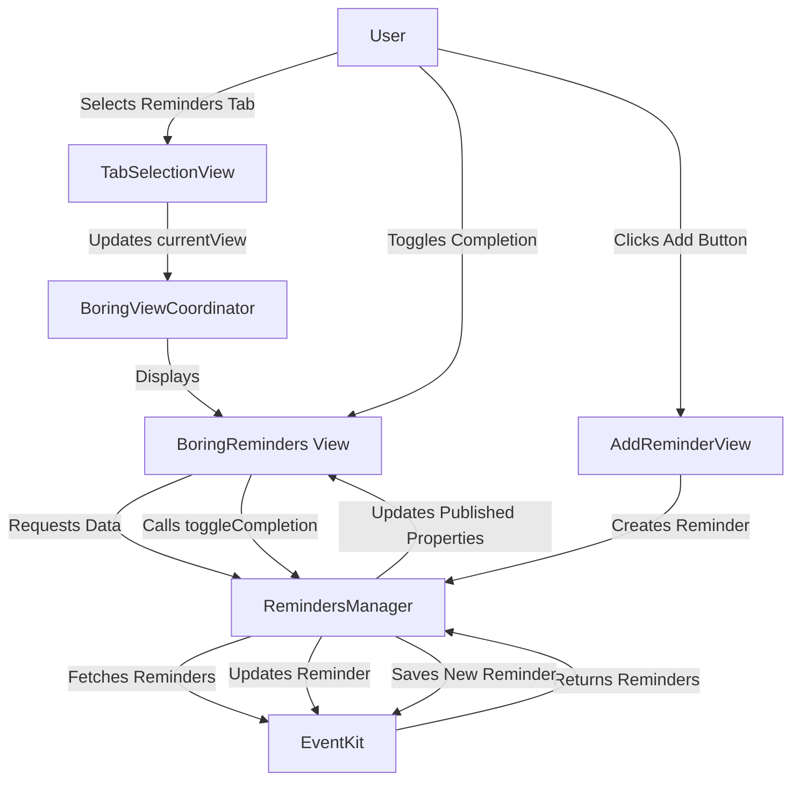
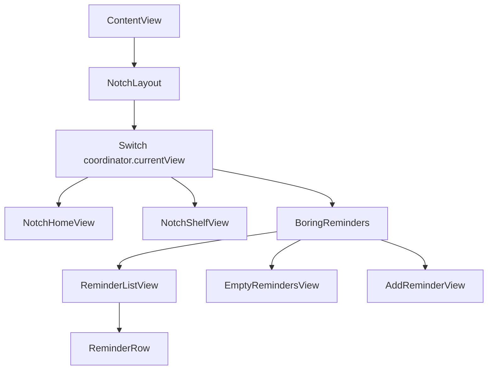

# Implementation Plan for Reminders Tab

## Overview
This plan outlines the steps to add a new reminders tab to the boringNotch app. The tab will integrate with macOS Reminders, display both complete and incomplete reminders, and provide functionality to add new reminders.

## 1. Update the NotchViews Enum
First, we need to add a new view type to the NotchViews enum in `boringNotch/enums/generic.swift`:

```swift
public enum NotchViews {
    case home
    case shelf
    case reminders  // New view for reminders
}
```

## 2. Create a RemindersManager Class
We'll create a new manager class to handle interactions with the EventKit framework for reminders, similar to how CalendarManager works:

```swift
// boringNotch/managers/RemindersManager.swift
import EventKit
import SwiftUI
import Defaults
import Combine

class RemindersManager: ObservableObject {
    @Published var reminders: [EKReminder] = []
    @Published var showCompleted: Bool = false
    private let eventStore = EKEventStore()
    @Published var authorizationStatus: EKAuthorizationStatus = .notDetermined
    
    init() {
        checkRemindersAuthorization()
    }
    
    func checkRemindersAuthorization() {
        let status = EKEventStore.authorizationStatus(for: .reminder)
        DispatchQueue.main.async {
            self.authorizationStatus = status
        }
        
        switch status {
            case .authorized, .fullAccess:
                fetchReminders()
            case .notDetermined:
                requestRemindersAccess()
            case .restricted, .denied, .writeOnly:
                // Handle the case where the user has denied or restricted access
                NSLog("Reminders access denied or restricted")
            @unknown default:
                print("Unknown authorization status")
        }
    }
    
    func requestRemindersAccess() {
        eventStore.requestFullAccessToReminders { [weak self] granted, error in
            DispatchQueue.main.async {
                if let error = error {
                    print("Reminders access error: \(error.localizedDescription)")
                }
                
                self?.authorizationStatus = granted ? .fullAccess : .denied
                if granted {
                    print("Reminders access granted")
                    self?.fetchReminders()
                } else {
                    print("Reminders access denied")
                }
            }
        }
    }
    
    func fetchReminders() {
        let predicate = eventStore.predicateForReminders(in: nil)
        
        eventStore.fetchReminders(matching: predicate) { [weak self] fetchedReminders in
            guard let reminders = fetchedReminders else { return }
            
            DispatchQueue.main.async {
                if self?.showCompleted == true {
                    self?.reminders = reminders.sorted { $0.dueDate ?? Date.distantFuture < $1.dueDate ?? Date.distantFuture }
                } else {
                    self?.reminders = reminders.filter { !($0.isCompleted) }
                        .sorted { $0.dueDate ?? Date.distantFuture < $1.dueDate ?? Date.distantFuture }
                }
            }
        }
    }
    
    func toggleCompletionFilter() {
        showCompleted.toggle()
        fetchReminders()
    }
    
    func toggleReminderCompletion(_ reminder: EKReminder) {
        reminder.isCompleted = !reminder.isCompleted
        
        do {
            try eventStore.save(reminder, commit: true)
            fetchReminders()
        } catch {
            print("Error toggling reminder completion: \(error)")
        }
    }
    
    func createReminder(title: String, notes: String? = nil, dueDate: Date? = nil, list: EKCalendar? = nil) -> Bool {
        let reminder = EKReminder(eventStore: eventStore)
        reminder.title = title
        reminder.notes = notes
        
        if let dueDate = dueDate {
            reminder.dueDateComponents = Calendar.current.dateComponents([.year, .month, .day, .hour, .minute], from: dueDate)
        }
        
        reminder.calendar = list ?? eventStore.defaultCalendarForNewReminders()
        
        do {
            try eventStore.save(reminder, commit: true)
            fetchReminders()
            return true
        } catch {
            print("Error creating reminder: \(error)")
            return false
        }
    }
    
    func openRemindersApp() {
        NSWorkspace.shared.open(URL(string: "x-apple.systempreferences:com.apple.preference.notifications")!)
    }
}
```

## 3. Create the Reminders View Component
Next, we'll create the main view component for displaying reminders:

```swift
// boringNotch/components/Reminders/BoringReminders.swift
import SwiftUI
import EventKit
import Defaults

struct BoringReminders: View {
    @StateObject private var remindersManager = RemindersManager()
    @State private var showAddReminderPopup = false
    @State private var newReminderTitle = ""
    @State private var newReminderDueDate: Date = Date()
    @State private var showDatePicker = false
    
    var body: some View {
        VStack(spacing: 8) {
            // Header with title and controls
            HStack {
                Text("Reminders")
                    .font(.system(size: 18))
                    .fontWeight(.semibold)
                
                Spacer()
                
                // Toggle for showing completed reminders
                Button(action: {
                    remindersManager.toggleCompletionFilter()
                }) {
                    Image(systemName: remindersManager.showCompleted ? "checkmark.circle.fill" : "checkmark.circle")
                        .foregroundColor(remindersManager.showCompleted ? Defaults[.accentColor] : .gray)
                }
                .buttonStyle(PlainButtonStyle())
                .help("Toggle Completed Reminders")
                
                // Add new reminder button
                Button(action: {
                    showAddReminderPopup = true
                }) {
                    Image(systemName: "plus.circle")
                        .foregroundColor(.gray)
                }
                .buttonStyle(PlainButtonStyle())
                .help("Add New Reminder")
            }
            
            // Reminders list
            if remindersManager.reminders.isEmpty {
                EmptyRemindersView()
            } else {
                ReminderListView(reminders: remindersManager.reminders, toggleCompletion: remindersManager.toggleReminderCompletion)
            }
        }
        .popover(isPresented: $showAddReminderPopup) {
            AddReminderView(
                isPresented: $showAddReminderPopup,
                createReminder: { title, date in
                    let success = remindersManager.createReminder(title: title, dueDate: date)
                    if success {
                        showAddReminderPopup = false
                        newReminderTitle = ""
                    }
                },
                openRemindersApp: {
                    remindersManager.openRemindersApp()
                    showAddReminderPopup = false
                }
            )
        }
    }
}

struct EmptyRemindersView: View {
    var body: some View {
        VStack(spacing: 10) {
            Image(systemName: "checkmark.circle")
                .font(.largeTitle)
                .foregroundColor(.gray)
            Text("No reminders")
                .font(.headline)
                .foregroundStyle(.white)
            Text("Add a reminder to get started")
                .font(.subheadline)
                .foregroundColor(.gray)
        }
        .frame(maxWidth: .infinity, maxHeight: .infinity)
    }
}

struct ReminderListView: View {
    let reminders: [EKReminder]
    let toggleCompletion: (EKReminder) -> Void
    
    var body: some View {
        ScrollView(showsIndicators: false) {
            VStack(alignment: .leading, spacing: 8) {
                ForEach(reminders, id: \.calendarItemIdentifier) { reminder in
                    ReminderRow(reminder: reminder, toggleCompletion: toggleCompletion)
                }
            }
        }
    }
}

struct ReminderRow: View {
    let reminder: EKReminder
    let toggleCompletion: (EKReminder) -> Void
    
    var body: some View {
        HStack(alignment: .top, spacing: 8) {
            Button(action: {
                toggleCompletion(reminder)
            }) {
                Image(systemName: reminder.isCompleted ? "checkmark.circle.fill" : "circle")
                    .foregroundColor(reminder.isCompleted ? .green : .gray)
            }
            .buttonStyle(PlainButtonStyle())
            
            VStack(alignment: .leading, spacing: 2) {
                Text(reminder.title)
                    .font(.footnote)
                    .foregroundStyle(reminder.isCompleted ? .gray : .white)
                    .strikethrough(reminder.isCompleted)
                
                if let dueDate = reminder.dueDateComponents?.date {
                    Text(dueDate, style: .date)
                        .font(.caption)
                        .foregroundColor(.gray)
                }
            }
            
            Spacer()
        }
        .padding(.vertical, 4)
        .opacity(reminder.isCompleted ? 0.6 : 1)
    }
}

struct AddReminderView: View {
    @Binding var isPresented: Bool
    let createReminder: (String, Date?) -> Bool
    let openRemindersApp: () -> Void
    
    @State private var title = ""
    @State private var notes = ""
    @State private var includeDueDate = false
    @State private var dueDate = Date()
    
    var body: some View {
        VStack(spacing: 16) {
            Text("New Reminder")
                .font(.headline)
            
            TextField("Title", text: $title)
                .textFieldStyle(RoundedBorderTextFieldStyle())
            
            Toggle("Include Due Date", isOn: $includeDueDate)
            
            if includeDueDate {
                DatePicker("Due Date", selection: $dueDate, displayedComponents: [.date, .hourAndMinute])
                    .datePickerStyle(CompactDatePickerStyle())
            }
            
            HStack {
                Button("Cancel") {
                    isPresented = false
                }
                
                Spacer()
                
                Button("Open Reminders App") {
                    openRemindersApp()
                }
                
                Button("Add") {
                    if !title.isEmpty {
                        createReminder(title, includeDueDate ? dueDate : nil)
                    }
                }
                .disabled(title.isEmpty)
                .keyboardShortcut(.defaultAction)
            }
        }
        .padding()
        .frame(width: 300)
    }
}
```

## 4. Update the TabSelectionView
We need to add the new reminders tab to the tabs array in `boringNotch/components/Tabs/TabSelectionView.swift`:

```swift
let tabs = [
    TabModel(label: "Home", icon: "house.fill", view: .home),
    TabModel(label: "Shelf", icon: "tray.fill", view: .shelf),
    TabModel(label: "Reminders", icon: "checkmark.circle", view: .reminders)
]
```

## 5. Update the ContentView
We need to modify the ContentView to display the reminders view when the reminders tab is selected. This will be done in the switch statement in `NotchHomeView.swift`:

```swift
switch coordinator.currentView {
case .home:
    NotchHomeView(albumArtNamespace: albumArtNamespace)
case .shelf:
    NotchShelfView()
case .reminders:
    BoringReminders()
}
```

## 6. Add Default Settings
Add any necessary default settings to the Constants.swift file:

```swift
// In Constants.swift, add to the Defaults.Keys extension
static let showReminders = Key<Bool>("showReminders", default: true)
```

## 7. Create a Default Setting in the Settings View
Add a toggle in the settings view to enable/disable the reminders feature:

```swift
// In SettingsView.swift, add to the appropriate section
Toggle("Show Reminders", isOn: Defaults.$showReminders)
    .toggleStyle(SwitchToggleStyle())
```

## Data Flow Diagram



## Component Hierarchy



## Implementation Steps

1. Create the RemindersManager.swift file in the managers directory
2. Create the BoringReminders.swift file in a new components/Reminders directory
3. Update the NotchViews enum in generic.swift
4. Update the tabs array in TabSelectionView.swift
5. Update the ContentView.swift to handle the new reminders view
6. Add default settings to Constants.swift
7. Update the SettingsView.swift to include reminders settings